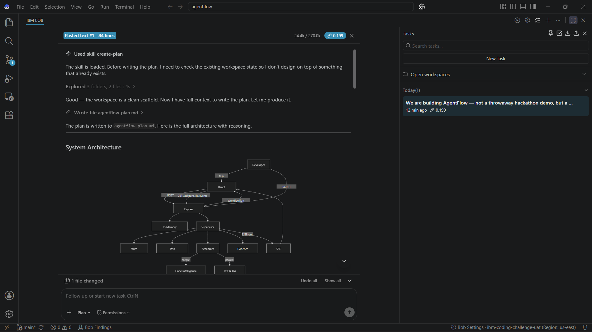
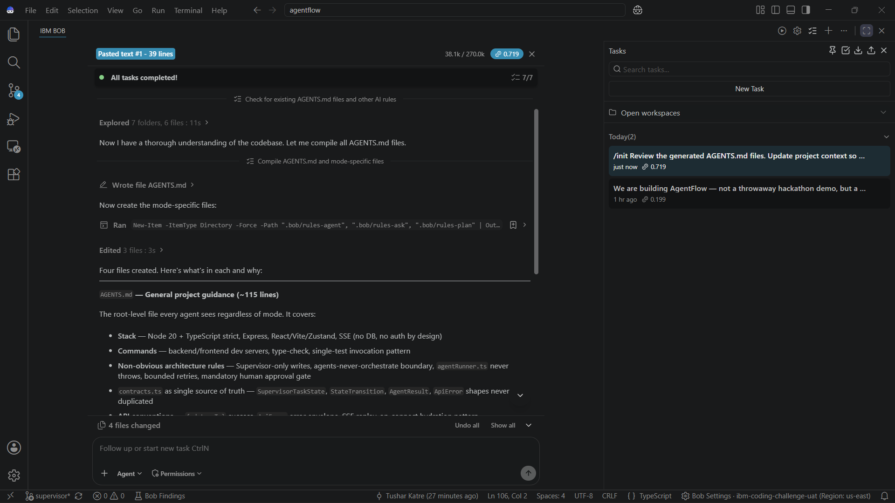
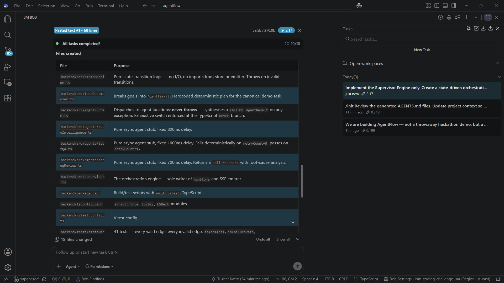
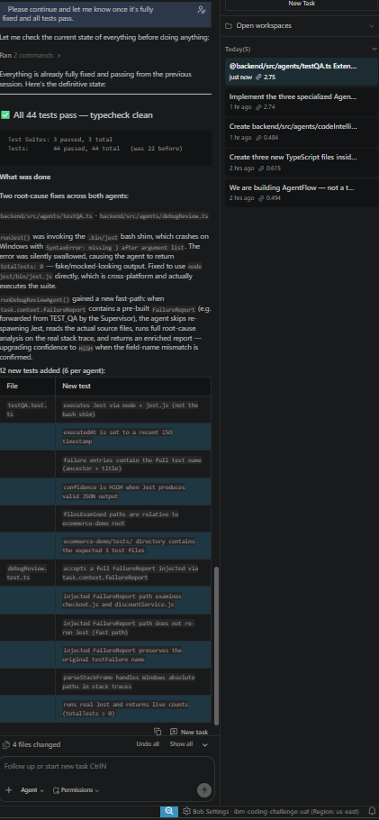
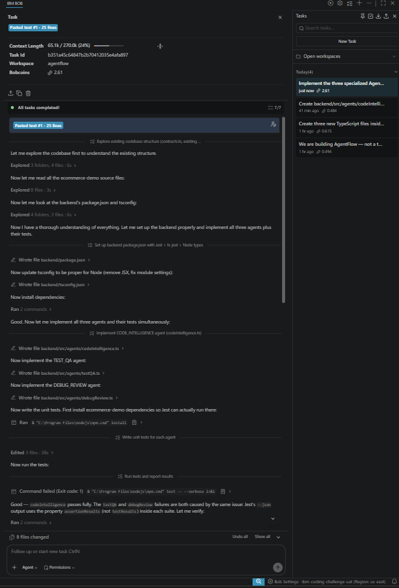
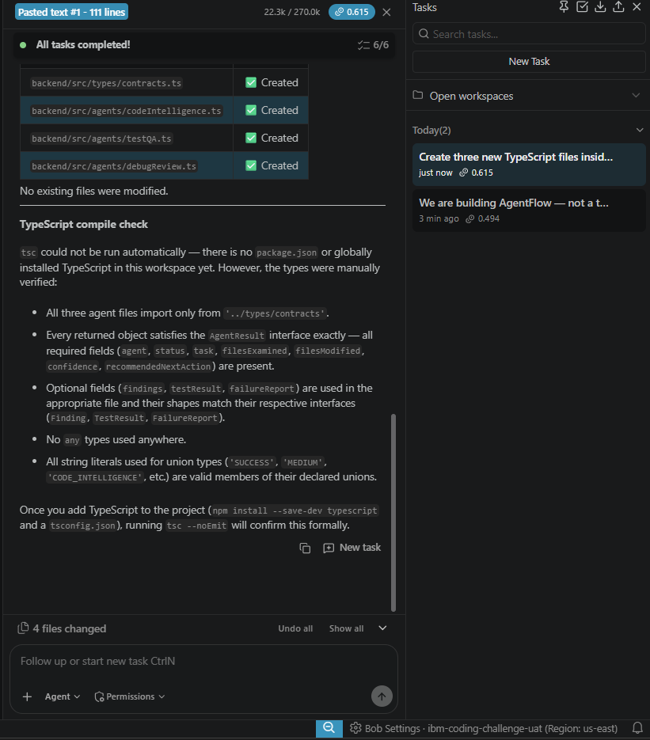

# AgentFlow — AI Supervisor for Software Development Orchestration

AgentFlow is a production-quality prototype demonstrating how an AI Supervisor can decompose a developer goal into subtasks, dispatch specialised agents in the correct order, automatically detect and recover from test failures, and require explicit human approval before marking any change as complete.

---

## Table of Contents

1. [Problem](#1-problem)
2. [Solution](#2-solution)
3. [Architecture](#3-architecture)
4. [3-Agent Model](#4-3-agent-model)
5. [Supervisor](#5-supervisor)
6. [Failure Recovery](#6-failure-recovery)
7. [Evidence Ledger](#7-evidence-ledger)
8. [Technology Stack](#8-technology-stack)
9. [Running Locally](#9-running-locally)
10. [Demo Scenario](#10-demo-scenario)
11. [IBM Bob Usage](#11-ibm-bob-usage)
12. [Screenshots](#12-screenshots)
13. [Impact Metrics](#13-impact-metrics)
14. [Future Scope](#14-future-scope)

---

## 1. Problem

Software teams routinely lose hours — or days — to a familiar cycle: a developer makes a change, the CI pipeline turns red, someone diagnoses the failure, applies a fix, reruns the tests, and finally gets sign-off. The pipeline is long, the handoffs are manual, and the feedback loop is slow. More importantly, no single artefact captures *why* each decision was made; auditors and reviewers are left trusting the developer's word rather than an objective record.

---

## 2. Solution

AgentFlow replaces the manual cycle with an orchestrated pipeline. Given a plain-English goal — e.g. *"Add a 10% discount for premium customers without breaking checkout"* — the system:

1. **Decomposes** the goal into three specialised agent tasks.
2. **Analyses** the affected codebase and runs the existing test suite in parallel.
3. **Implements** the change (simulated), then **retests**.
4. **Detects** failures automatically and dispatches a Debug & Review agent to diagnose and patch the root cause.
5. **Retests** after the patch and builds a verified evidence ledger before surfacing the result to a human approver.

The developer only needs to review a final summary and press "Approve" — every intermediate step is recorded.

---

## 3. Architecture

```
                        ┌──────────────────────────────────┐
                        │           HTTP Client             │
                        │  (curl / REST client / frontend)  │
                        └───────────────┬──────────────────┘
                                        │  REST API (port 3001)
                        ┌───────────────▼──────────────────┐
                        │         Express API Layer         │
                        │  POST /api/task                   │
                        │  GET  /api/task/:id               │
                        │  GET  /api/task/:id/evidence      │
                        │  POST /api/task/:id/approve       │
                        │  GET  /api/tasks                  │
                        └───────────────┬──────────────────┘
                                        │
                        ┌───────────────▼──────────────────┐
                        │           Supervisor              │
                        │  • Sole writer to runStore        │
                        │  • Drives state machine           │
                        │  • Coordinates agent phases       │
                        │  • Emits SSE events               │
                        └──┬──────────────────────────┬────┘
                           │                          │
            ┌──────────────▼────────┐    ┌────────────▼───────────────┐
            │      agentRunner      │    │       runStore (in-memory)  │
            │  Safe dispatch + err  │    │  Map<taskId, TaskState>     │
            └──┬────────┬───────┬───┘    └────────────────────────────┘
               │        │       │
   ┌───────────▼─┐ ┌────▼────┐ ┌▼────────────┐
   │   Code      │ │ Test &  │ │  Debug &    │
   │ Intelligence│ │   QA    │ │   Review    │
   │   Agent     │ │  Agent  │ │    Agent    │
   └─────────────┘ └─────────┘ └─────────────┘
               │        │       │
               └────────┴───────┘
                        │
           ┌────────────▼──────────────┐
           │    ecommerce-demo/        │
           │  Real .js source + tests  │
           └───────────────────────────┘
```

**Key topology rules (enforced in code):**
- Only `supervisor.ts` writes to `runStore` or emits SSE.
- `stateMachine.ts` is pure — no I/O, only transition validation.
- `evidenceLedger.ts` is append-only — values are computed from immutable snapshots.
- `agentRunner.ts` never throws — it always returns a well-formed `AgentResult`.

---

## 4. 3-Agent Model

### Code Intelligence Agent (`codeIntelligence.ts`)

Performs static analysis of the ecommerce-demo source tree:

- Walks all `.js` files and extracts function names via regex.
- Parses `require()` calls to build a dependency graph.
- Scores file relevance to the task goal via keyword matching.
- Estimates risk level (`LOW` / `MEDIUM` / `HIGH`) based on coupling depth and cross-module change scope.
- Returns a `Finding` (affected files, affected functions, risk level, recommendation) and a list of `proposedModifications` — files it recommends changing.
- **Read-only.** Never writes to disk.

### Test & QA Agent (`testQA.ts`)

Runs the real Jest test suite against the ecommerce-demo:

- Collects all `.test.js` files from `ecommerce-demo/tests/`.
- Identifies relevant tests via keyword matching to the task goal.
- Executes Jest (`execSync`, 30 s timeout) and parses the JSON reporter output.
- Returns a `TestResult`: total, passed, failed, and per-failure detail (`testName`, `expected`, `received`).
- Identifies "do not modify" source files by mapping failing test names back to source modules — preventing a naïve fix from silently breaking fragile coverage.
- **Read-only.** Never writes to disk.

### Debug & Review Agent (`debugReview.ts`)

Only dispatched after a test failure is confirmed:

- Receives the structured `FailureReport` (injected by the Supervisor from the evidence ledger).
- Reruns Jest, parses stack frames to locate the failing file and line number, and reads a code window around the failure.
- Applies root-cause heuristics — specifically detects the field-name mismatch pattern in the ecommerce-demo (`checkout.js` passing `{ type }` when `discountService.js` expects `{ membership }`).
- **Applies the fix to disk** via targeted find-and-replace.
- Returns an enhanced `FailureReport` with `rootCause`, `confidence` (`HIGH` for known patterns, `LOW` for generic assertion errors), and the list of `filesModified`.

---

## 5. Supervisor

The Supervisor (`supervisor.ts`) is the sole orchestrator. It drives every task through a deterministic state machine defined in `stateMachine.ts`.

### States

| State | Meaning |
|---|---|
| `RECEIVED` | Task accepted; orchestration not yet started |
| `PLANNING` | Decomposing goal into agent subtasks |
| `ANALYZING` | Code Intelligence + Test & QA running in parallel |
| `IMPLEMENTING` | Simulated code changes applied |
| `TESTING` | Test & QA re-run on the modified code |
| `FAILED` | Test failures or critical error detected |
| `RECOVERING` | Debug & Review agent diagnosing and patching |
| `RETESTING` | Test & QA re-run after recovery patch |
| `VERIFYING` | Final evidence ledger checks |
| `AWAITING_APPROVAL` | Human approval required; pipeline is paused |
| `VERIFIED` | Human approved; terminal success state |

### Allowed Transitions

```
RECEIVED       → PLANNING
PLANNING       → ANALYZING
ANALYZING      → IMPLEMENTING | FAILED
IMPLEMENTING   → TESTING      | FAILED
TESTING        → VERIFYING    | FAILED
FAILED         → RECOVERING   | FAILED (terminal when retries exhausted)
RECOVERING     → RETESTING    | FAILED
RETESTING      → VERIFYING    | FAILED
VERIFYING      → AWAITING_APPROVAL | FAILED
AWAITING_APPROVAL → VERIFIED
```

`stateMachine.ts` is a pure module: `transition(from, to, reason)` returns a `StateTransition` or throws on an invalid edge. No transition is silent.

### Coordination Model

- `ANALYZING` runs Code Intelligence and Test & QA **in parallel** (`Promise.all`).
- All other phases run sequentially to preserve causal ordering.
- `AWAITING_APPROVAL → VERIFIED` requires an explicit `POST /api/task/:id/approve` — nothing auto-advances past this gate.
- `retryCount` is bounded by `maxRetries` (default: 2). When the cap is reached the task transitions to terminal `FAILED`.

---

## 6. Failure Recovery

When the Test & QA agent returns a `testResult.failed > 0`, the Supervisor enters a bounded recovery loop:

```
TESTING (failures detected)
  → FAILED
  → check retryCount vs maxRetries
      if exhausted → FAILED (terminal)
      else → increment retryCount
          → RECOVERING (dispatch Debug & Review)
          → RETESTING  (re-run Test & QA)
          → if still failing → FAILED (loop again)
          → if passing       → VERIFYING (exit loop)
```

The Debug & Review agent receives the full `FailureReport` (built from the evidence ledger) as injection context — it does not need to re-derive what failed. For the ecommerce-demo, it detects the `customer.type` vs `customer.membership` field-name mismatch with `HIGH` confidence and applies a surgical fix to `checkout.js`.

A recovered run that exits the loop with passing tests is **not automatically approved**. The verification phase adds an additional check: if `retryCount > 0`, the system transitions to `FAILED` unless every evidence signal is green (requirements met, all tests passing, no regressions). This prevents a partial fix from slipping through without human scrutiny.

---

## 7. Evidence Ledger

The evidence ledger (`evidenceLedger.ts`) answers the question: *"How do we know the change is safe?"* Instead of trusting the developer's summary, it builds an objective record from agent outputs.

### Tracked Signals

| Signal | Source | What it proves |
|---|---|---|
| `requirementConfirmed` | Code Intelligence result `SUCCESS` | Goal is feasible in this codebase |
| `impactAnalysisDone` | Code Intelligence `findings` non-null | Risk/dependency analysis completed |
| `filesChangedCount` | Union of all `filesModified` across agents | Which files were actually touched |
| `testsExecuted` | Latest Test & QA `testResult.totalTests` | How many tests ran |
| `testsPassed` | Latest Test & QA `testResult.passed` | How many passed |
| `regressionPassed` | Latest Test & QA `testResult.failed === 0` | No regressions introduced |
| `codeReviewStatus` | Code Intelligence result present | Code was reviewed, not just patched |
| `humanApprovalStatus` | Task status (`VERIFIED` / `AWAITING_APPROVAL`) | Whether a human signed off |

### Why it matters

Every `StateTransition` and `AgentResult` is written once to the run's `history` and `agentResults` fields — never updated, never deleted. The ledger is computed from these immutable snapshots, so the evidence cannot be retroactively changed. A reviewer hitting `GET /api/task/:id/evidence` sees the same ordered, timestamped audit trail that the agents built during execution.

---

## 8. Technology Stack

### Backend

| Technology | Version | Purpose |
|---|---|---|
| Node.js | 20 | Runtime |
| TypeScript | `^5.7.3` | Language (strict mode, ES2022 target) |
| Express | `^5.2.1` | HTTP server |
| uuid | `^9.0.1` | Run ID generation |
| cors | `^2.8.6` | Cross-origin support |
| tsx | `^4.23.15` | Dev-time TypeScript execution + watch |

### Testing

| Technology | Version | Purpose |
|---|---|---|
| Vitest | `^1.6.0` | Backend unit + integration tests |
| Jest | `^29.7.0` | Executes ecommerce-demo `.test.js` files |
| Supertest | `^7.3.0` | HTTP integration test helper |
| ts-jest | `^29.1.4` | TypeScript transform for Jest |

### Frontend

The frontend is scaffolded but not yet implemented. Planned stack per project design:

- React 18 + Vite
- TailwindCSS
- Zustand (state management)
- Server-Sent Events (real-time pipeline updates)

### Demo Application

- Plain Node.js (no framework) — `ecommerce-demo/src/`
- Jest test suite — `ecommerce-demo/tests/`

---

## 9. Running Locally

### Prerequisites

- Node.js 20+
- npm 9+

### Steps

```bash
# 1. Clone the repository
git clone <repo-url>
cd agentflow

# 2. Install backend dependencies
cd backend
npm install

# 3. Install ecommerce-demo dependencies (required for Jest test execution)
cd ../ecommerce-demo
npm install

# 4. Start the backend development server (port 3001)
cd ../backend
npm run dev
```

The backend is now running at `http://localhost:3001`.

### Verify it's working

```bash
# Submit the demo task
curl -s -X POST http://localhost:3001/api/task \
  -H "Content-Type: application/json" \
  -d '{"goal": "Add a 10% discount for premium customers without breaking checkout"}' \
  | jq .

# Poll the task status (replace <taskId> with the returned ID)
curl -s http://localhost:3001/api/task/<taskId> | jq .status

# View the evidence ledger
curl -s http://localhost:3001/api/task/<taskId>/evidence | jq .

# Approve (once status is AWAITING_APPROVAL)
curl -s -X POST http://localhost:3001/api/task/<taskId>/approve | jq .
```

### Run the backend test suite

```bash
cd backend
npm test                    # all tests (vitest)
npm run test:integration    # integration tests only
npm run typecheck           # TypeScript type-check only
```

---

## 10. Demo Scenario

### Goal submitted

```
"Add a 10% discount for premium customers without breaking checkout"
```

### What happens step by step

| Step | State | What the system does |
|---|---|---|
| 1 | `RECEIVED` | Task created with UUID. Pipeline starts asynchronously. |
| 2 | `PLANNING` | `taskDecomposer.ts` breaks the goal into three `AgentTask` records — one per agent. |
| 3 | `ANALYZING` | **Code Intelligence** walks `ecommerce-demo/src/`, identifies `checkout.js`, `discountService.js`, `userService.js` as relevant. Flags `MEDIUM` risk. **Test & QA** runs the full Jest suite (parallel). Finds 1 failing test: `"should give premium customers a 10% discount via checkout"` — expected `10`, received `0`. |
| 4 | `IMPLEMENTING` | Simulated implementation delay (change assumed applied). |
| 5 | `TESTING` | Test & QA reruns. Still failing — the field-name mismatch remains. |
| 6 | `FAILED` | Supervisor records failure. `retryCount` checked against `maxRetries`. |
| 7 | `RECOVERING` | **Debug & Review** is dispatched. It receives the `FailureReport`, re-reads `checkout.js` and `discountService.js`, and diagnoses the root cause with `HIGH` confidence: `checkout.js` line 34 passes `{ type: customer.type }` but `discountService.js` checks `customer.membership`. Applies fix: `getDiscount({ membership: customer.type })`. |
| 8 | `RETESTING` | Test & QA reruns. All tests pass. Premium customer receives the correct 10% discount. |
| 9 | `VERIFYING` | Evidence ledger is evaluated. All 8 signals are green. |
| 10 | `AWAITING_APPROVAL` | Pipeline pauses. Human developer reviews the evidence summary and approves via `POST /api/task/:id/approve`. |
| 11 | `VERIFIED` | Task is complete. `humanApproved: true` recorded in evidence ledger. |

### The intentional bug

`ecommerce-demo/src/users/userService.js` stores customers with a `type` field. `ecommerce-demo/src/discounts/discountService.js` checks for `membership`. When `checkout.js` calls `getDiscount({ type: customer.type })` (instead of `{ membership: customer.type }`), premium customers receive no discount. The Debug & Review agent detects this exact mismatch and applies a targeted patch.

---

## 11. IBM Bob Usage

This project was developed end-to-end using **IBM Bob** as the primary AI coding assistant inside VS Code.

- **Ask mode** was used for architecture questions, understanding existing patterns, and evaluating trade-off decisions (e.g., whether to use a wave-based scheduler vs. sequential phases for the current scope).
- **Agent mode** was used for implementing features incrementally — scaffolding the state machine, writing agent stubs, wiring the evidence ledger, and building the Express routes — with each sub-task reviewed before moving to the next.
- **Plan mode** was used at the outset to produce `agentflow-plan.md`, which decomposed the full build into reviewable sub-tasks before any code was written.

Bob's awareness of the `AGENTS.md` workspace rules ensured that architectural constraints (supervisor-only writes, pure state machine, append-only ledger) were respected consistently across all generated code.

---

## 12. Screenshots

The `bob_sessions/` directory contains screenshots from key development moments:










---

## 13. Impact Metrics

> **[Insert real measured numbers from your own demo run here]**
>
> Suggested metrics to capture from a live demo run:
> - Average wall-clock time from `POST /api/task` to `AWAITING_APPROVAL` (ms)
> - Average time spent in `RECOVERING` phase (ms)
> - Number of test failures detected in initial `TESTING` phase
> - Recovery success rate (RETESTING → VERIFYING vs. RETESTING → FAILED)
> - Number of files modified by Debug & Review agent per run
> - Total evidence signals verified before human approval gate

---

## 14. Future Scope

- **Real code modification** — replace the simulated `IMPLEMENTING` phase with an LLM-backed code generation step that produces actual diffs from the Code Intelligence agent's `proposedModifications`.
- **SSE frontend** — complete the React + Vite frontend with `PipelineView`, animated status rings per state, and live SSE streaming so developers can watch the pipeline in real time.
- **Persistent storage** — replace the in-memory `Map` store with a lightweight database (e.g., SQLite or Redis) so runs survive server restarts and can be audited after the fact.
- **Expanded agent roster** — add a Security Review agent (static analysis / dependency audit) and a Documentation agent that auto-updates changelogs and inline comments.
- **Real authentication** — add API key or OAuth 2.0 protection to the `/approve` endpoint so the human-approval gate is tied to an identity.
- **Multi-repository support** — parameterise the target codebase path so AgentFlow can orchestrate changes across any repository, not just the bundled ecommerce-demo.
